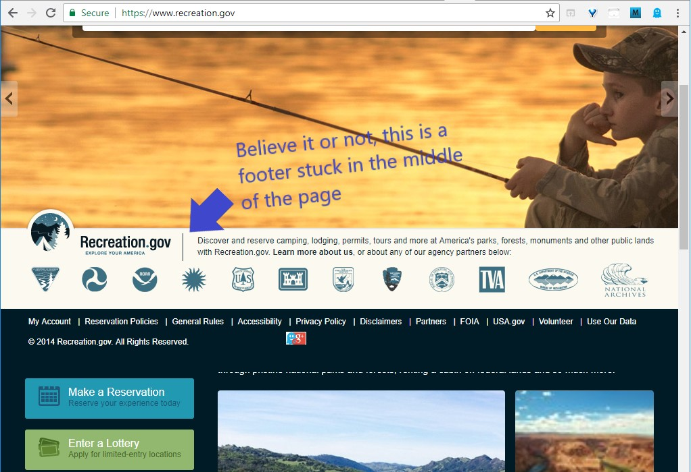

Chrome browser fix for Recreation.gov
=====================

For many months now (Jul-2018) [Recreation.gov](https://www.recreation.gov/) website has had an annoying bug with Chrome. The footer is stuck in the middle of the page preventing users from making reservations and reading content. The fix is very simple, but obviously there is no rush to implement it.
This extension solves the problem in the meantime.

## Screenshot

&emsp;

## How to install

 * download all files from this repository in a new folder
 * Chrome > Menu > More Tools > Extensions  
	or if you are in Chrome, just copy this link *chrome://extensions/* into the address bar
 * Set "Developer Mode" to On
 * Click "LOAD UNPACKED" 
 * select the folder with the files from your drive and hit Ok

## Result

Navigating [Recreation.gov](https://www.recreation.gov/) with Chrome now should be much more pleasant with the footer staying where it belongs - on the bottom. 
 *Note: Firefox shows the website correctly.*

&emsp;
